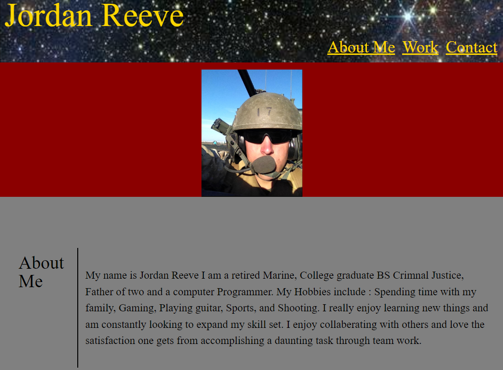
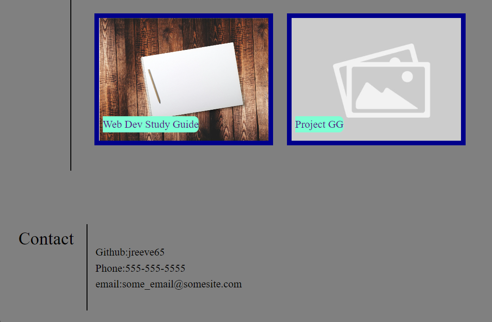

# Portfolio

## Description
   A portfolio show casing projects I have made as a software developer. the portfolio also serves as an additional project to showcase in and of its self.

## Installation
N/A

## Usage
    Provides an organized space to store projects I have made/worked on for potential employers to view.
## Screen Shot

## Credits

README. Template Provided by codeing boot camp Full- Stack Blog. url: https://coding-boot-camp.github.io/full-stack/github/professional-readme-guide

Image courtesy of NASA image source : https://www.rmg.co.uk/stories/topics/james-webb-space-telescope-first-year-images

Note book image found at source :https://www.pexels.com/photo/pencil-on-spiral-drawing-notebook-163031/

## License

N/A
